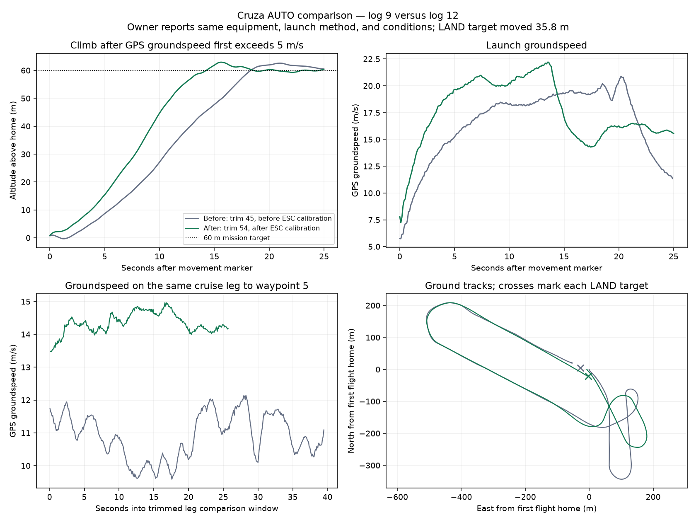

# Cruza second AUTO flight — 2026-10-09

The logs support the owner's report that this flight worked well. Compared with log 9, the new flight climbed to 60 m sooner, avoided the earlier initial height dip, and flew the same long cruise leg faster with lower commanded throttle. Pitch tracking improved, and roll tracking on that straight leg was similar. Retain the present settings as the new baseline; this review does not justify another thrust or PID increase.

## Evidence and setup

- Flight log: `logs/2026-10-09/download-110522_067346/log_00012.BIN`, 6,914,048 bytes, onboard index timestamp 11:00:56 a.m. CDT.
- Baseline: `logs/2026-10-09/log_00009.BIN` and [first flight review](flight-review-2026-10-09.md).
- Owner reports the same method, equipment, and conditions. Logs show AUTO throughout, a 10° minimum-pitch/60 m takeoff command, the same circuit waypoints apart from tiny coordinate rounding, and a LAND target moved approximately **35.8 m**. Wind and launch technique were not independently measured.
- TRIM_THROTTLE changed from 45 to 54. The takeoff limit, ESC output endpoints, airspeed configuration, navigation settings, and control gains match the baseline. Gyro offsets, barometric ground pressure, and runtime counters changed as expected between boots/flights. ESC calibration is an external ESC state and is not stored in the flight controller's PARM records.
- Both flights used 100% / 1900 µs during takeoff. Both had full output before the GPS movement marker. The new flight followed the attended 1100–1900 µs ESC calibration and smooth props-off startup check.
- Logs 10 and 11 were also retrieved; their low GPS speeds and ground-scale altitude variation identify them as bench activity, not additional flights. All three downloaded sizes match the onboard index. No BAD_DATA records were parsed in log 12.

## Comparison

The launch movement marker is the first GPS sample at or above 5 m/s, not an exact throw-release measurement. Cruise figures below use the middle of the **same leg to waypoint 5**, omitting the first 10 seconds and final 5 seconds in each flight. The baseline comparison interval is controller time 514.839–554.339 s; the new interval is 127.481–153.181 s.

| Metric | First flight, log 9 | New flight, log 12 | Finding |
|---|---:|---:|---|
| Movement marker to first reaching 60 m | 18.34 s | 14.26 s | About 22% sooner |
| AUTO trigger to takeoff-stage completion | 22.48 s | 15.68 s | About 30% sooner; includes pre-release time |
| Height at movement marker / minimum in following 3 s | 0.72 / −0.33 m | 0.90 / 0.90 m | Earlier ~1.05 m initial dip absent in new samples |
| Peak GPS climb rate during takeoff | 5.65 m/s | 7.24 m/s | Stronger observed climb |
| Median groundspeed on matched cruise leg | 10.93 m/s | 14.30 m/s | About 31% higher |
| Median throttle output on matched leg | 58.94% | 50.03% | Lower command despite higher groundspeed |
| Altitude range on matched leg | 59.57–60.52 m | 58.78–61.04 m | Both close to the 60 m target |
| Pitch tracking RMS error on matched leg | 1.66° | 1.31° | Improved |
| Roll tracking RMS error on matched leg | 1.65° | 1.59° | Similar, slightly improved |

The faster climb and acceleration with the same full-throttle PWM command are consistent with more effective propulsion after ESC calibration. These logs cannot isolate the calibration's contribution from the simultaneous cruise-trim change and unmeasured flight differences, or directly quantify physical thrust. GPS groundspeed is not measured airspeed.

Across a broader cruise comparison window, median groundspeed increased from 10.80 to 14.58 m/s and median throttle fell from 58.89% to 49.96%. That comparison selects samples within 2 m of target altitude. The corresponding **unfiltered** cruise altitude ranges are 58.22–61.16 m before and 58.78–63.16 m after; the new flight briefly overshot more during early cruise/turns. Broad-window roll RMS was 2.60° before and 3.89° after, whereas pitch RMS improved from 2.07° to 1.74°. Turn transitions account for much of the difference from the matched straight-leg results; do not claim every control metric improved.

## Mission and landing

The new log progressed through the circuit, NAV_LAND, flare, and disarm. The flare message records 2.9 m height, 1.18 m/s sink, 12.2 m/s speed, and 58.3 m distance to target. Throttle cut to 1100 µs at flare. The final distance message was **3.70 m from the new LAND point**, versus 30.73 m from the earlier flight's LAND point. Because the target moved 35.8 m, those distances are not a controlled comparison of landing accuracy. Log 12 contains a disarm record but no "Auto disarmed" message; do not label its disarm as automatic.

The approach included a brief demanded pitch near −23.6° with actual pitch near −21.2°. This was a commanded maneuver, rather than evidence by itself of uncontrolled oscillation. The owner reports a good landing, but the log alone does not establish touchdown quality or surface condition.

Waypoint 3 was accepted approximately 0.1 s after waypoint 2. WP_RADIUS remains 90 m, and the short leg between these waypoints is about 97 m, so waypoint acceptance/turn anticipation can substantially shorten it. The ground-track comparison shows different initial turn paths. If the goal is to fly every short pattern leg closely, review waypoint spacing and acceptance geometry before changing roll gains. No mission or parameter changes were made during this review.

## Sensors and remaining limits

- No ERR records, EKF fault-field flags, or EKF GPS-check flags were found; XKF4.FS and XKF4.GPS remained zero. GPS reported 26–29 satellites and HDOP 0.47–0.52.
- From launch movement through approach start, neither IMU accumulated accelerometer clipping. Vibration was generally modest, with the largest pre-approach axis maximum about 10.8 m/s². Around controller time 213.86 s, during the landing stop, IMU0/IMU1 accumulated 16/17 clipping events. Treat this as a brief landing-area shock observation, not evidence of sustained cruise vibration.
- Battery voltage reported 15.80–16.24 V, consistent with the confirmed 4S pack. Logged current remained approximately 0.19–0.20 A and is unsuitable for motor power or useful remaining-capacity assessment. With the original external ESCs, their power may bypass the AIO's current-sensing path; trace wiring before assuming a sensor-scale correction is sufficient.
- ARSPD_TYPE remains 0. Reported/estimated airspeed is not an enabled pitot measurement. Avoid interpreting GPS groundspeed as a stall margin.
- Live postflight export confirms BATT_MONITOR=4, both battery failsafe actions=1, BATT_ARM_VOLT≈13.2, and TRIM_THROTTLE=54. No temporary ESC-calibration overrides remain. ARMING_MAGTHRESH=300 and ARMING_SKIPCHK=4096 remain historical settings requiring their separate review; this report does not certify the full preflight configuration.

Keep cruise trim at 54 and retain the calibrated endpoints and current gains. The next tuning work, if needed, should follow a specific remaining behavior or controlled FBWA/AUTOTUNE inputs rather than another general power increase. Correctly measuring propulsion current and enabling/verifying the airspeed sensor would improve later energy and speed analysis.

## Saved artifacts and integrity

- New live parameters: `params/cruza_params_2026-10-09_110522_067346_postflight.params`.
- Quantitative comparison: `logs/2026-10-09/download-110522_067346/comparison-with-log9.json`.
- Individual plot: `logs/2026-10-09/download-110522_067346/log_00012.png`.
- Original BINs, summaries, log index, and firmware identity are saved in the same download directory. Full parsed records are locally reproducible and excluded from Git.

| Log | SHA-256 |
|---|---|
| 12 — flight | `4f0a649db8807e6b5b020931058efe4406d6f1008adb084954ed821dad7bb4bd` |
| 11 — bench | `10166ed681fd5914682a15410e075c30821fcc64a4f8e4710f735b5f95b3307c` |
| 10 — bench | `46486d76d46a98440b56f2c94c87501bed3afcb792d2823094d8a3271559279d` |
